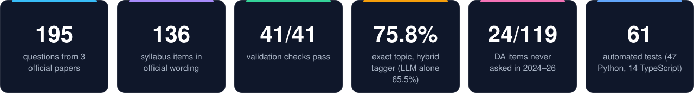
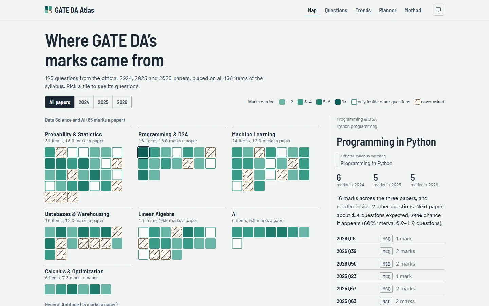
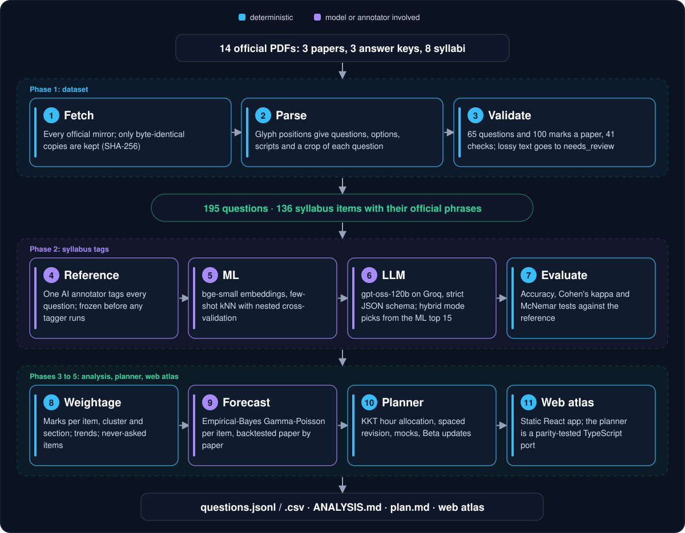
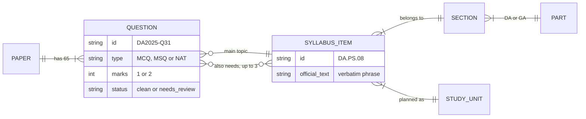
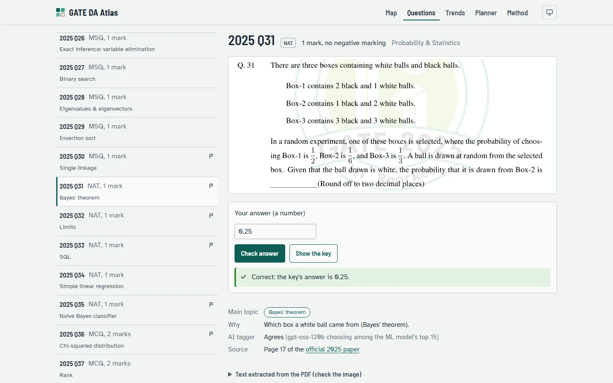
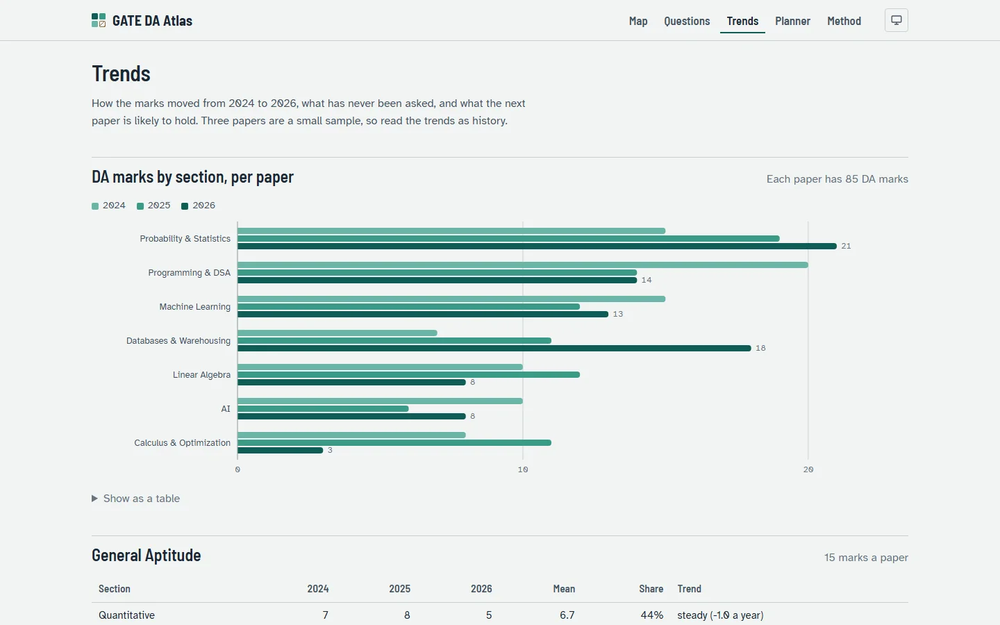
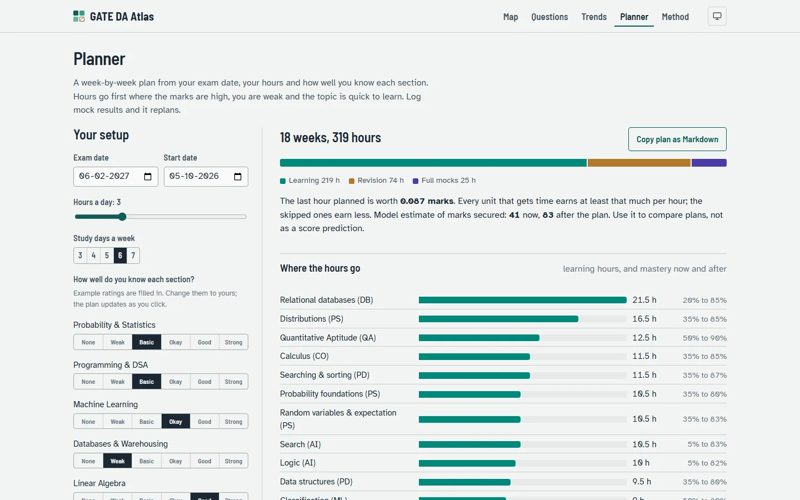
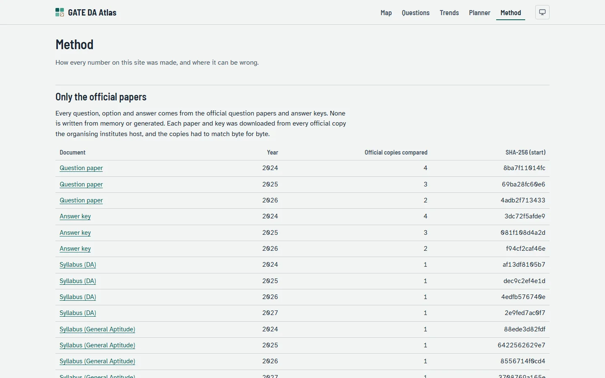

<p align="center">
  
</p>

<p align="center">
  
  
  
  
  
  
  
  
</p>

<p align="center">
  <b>195 questions from the official GATE DA papers of 2024, 2025 and 2026, each tagged to one of 136 official
  syllabus items, then turned into weightage, a tested forecast, an adaptive study planner and a web atlas.</b><br>
  Built for GATE DA 2027 preparation. Every question, option and answer comes from the official PDFs; nothing is
  written from memory.
</p>

<p align="center">
  <a href="#-results">Results</a> ·
  <a href="#-how-it-works">How it works</a> ·
  <a href="#-quick-start">Quick start</a> ·
  <a href="#-the-web-atlas">Web atlas</a> ·
  <a href="#-methodology">Methodology</a> ·
  <a href="#-limits">Limits</a>
</p>

<p align="center">
  
</p>

<p align="center">
  <picture>
    <source media="(prefers-color-scheme: dark)" srcset="docs/screenshots/01_map_dark.webp">
    
  </picture><br>
  <sub>The web atlas. Each tile is one syllabus item, shaded by the marks its questions carried in the three papers; hatched tiles were never asked.</sub>
</p>

## ✨ What makes it different

<table>
  <tr>
    <td width="50%" valign="top">
      <h4>📄 Only official sources</h4>
      14 PDFs are fetched from every official mirror and kept only when the copies match byte for byte (SHA-256).
      Each question keeps a crop of the official page, and the 84 questions whose extracted text is lossy are flagged
      <code>needs_review</code> instead of being retyped from memory.
    </td>
    <td width="50%" valign="top">
      <h4>🤖 AI and ML, both measured</h4>
      Embedding retrieval, a few-shot kNN with nested cross-validation, and <code>gpt-oss-120b</code> with a strict JSON
      schema are all scored against frozen reference tags. Letting the LLM choose from the ML model's top 15 lifts
      exact-topic accuracy on DA from 65.5% to 75.8% (McNemar p = 0.03).
    </td>
  </tr>
  <tr>
    <td valign="top">
      <h4>📈 A forecast that is tested</h4>
      An empirical-Bayes Gamma–Poisson model gives each syllabus item its chance of appearing in the next paper.
      Holding out each paper in turn, it beats both baselines on Brier score, log loss and count error, by a small
      margin, and the tables say so.
    </td>
    <td valign="top">
      <h4>🧭 A planner with real maths</h4>
      Hours go where the next hour is worth the most marks (KKT conditions on concave learning curves), and mock results
      update mastery as Beta evidence. The browser planner reproduces the Python plans exactly, checked by 14 parity tests.
    </td>
  </tr>
</table>

## 📊 Results

Every number here is regenerated by the commands in [Quick start](#-quick-start); the full reports are
[`VALIDATION.md`](data/processed/VALIDATION.md), [`TAGGING.md`](data/processed/TAGGING.md) and
[`ANALYSIS.md`](data/processed/ANALYSIS.md).

### The dataset

| Paper | Questions | Marks | MCQ | MSQ | NAT | Clean text | Read the image (`needs_review`) |
| --- | ---: | ---: | ---: | ---: | ---: | ---: | ---: |
| 2024 | 65 | 100 | 37 | 12 | 16 | 33 | 32 |
| 2025 | 65 | 100 | 35 | 18 | 12 | 34 | 31 |
| 2026 | 65 | 100 | 33 | 14 | 18 | 44 | 21 |
| **All** | **195** | **300** | **105** | **44** | **46** | **111** | **84** |

All 41 validation checks pass: 65 question numbers in order and 100 marks per paper, GA = 5×1 + 5×2 and
DA = 25×1 + 30×2 marks, printed mark headings agree with the key, keyed options exist, every question has a crop,
and the raw PDFs match their checksums. A few records:

| Id | Type | Marks | Key | Main topic | Text |
| --- | --- | ---: | --- | --- | --- |
| DA2024-Q01 | MCQ | 1 | D | Analogy | clean |
| DA2024-Q46 | MSQ | 2 | A, B, D | Normal forms | clean |
| DA2025-Q31 | NAT | 1 | 0.25 | Bayes' theorem | fractions: read the image |
| DA2024-Q59 | NAT | 2 | marks to all | Conditional expectation & variance | stacked maths: read the image |

### Tagging every question to the syllabus

| Tagger, scored against the reference tags | Questions | Exact item | | Right section |
| --- | ---: | ---: | --- | ---: |
| Sentence embeddings only (`bge-small-en-v1.5`, zero-shot) | 195 | 39.0% | `███▉` | 80.0% |
| Embeddings + labelled neighbours (few-shot kNN, nested CV) | 195 | 39.5% | `████` | 84.6% |
| `gpt-oss-120b` choosing from the whole syllabus | 195 | 65.6% | `██████▌` | 93.3% |
| **`gpt-oss-120b` choosing from the ML top 15 (DA only)** | 165 | **75.8%** | `███████▋` | **95.2%** |

On the same 165 DA questions the whole-syllabus LLM is right 65.5% of the time. The hybrid wins 36 of the
questions where the two disagree and loses 19 (exact McNemar test, p = 0.03). For sections alone, a classifier on
the embeddings gets 92.7% of DA questions right, against 78.2% for TF-IDF and 20.6% for always guessing the most
common section.

> [!NOTE]
> The reference tags were written by one annotator (Claude, the AI assistant that built this repository), from the
> text of clean questions and the crops of flagged ones, and frozen before any tagger ran. They are a careful
> judgement, not ground truth. [`tag_disagreements.csv`](data/processed/tag_disagreements.csv) lists every place the
> LLM disagrees, for a human to review.

### What the papers say

| DA section | 2024 | 2025 | 2026 | Marks a paper | |
| --- | ---: | ---: | ---: | ---: | --- |
| Probability & Statistics | 15 | 19 | 21 | 18.3 | `█████████▏` |
| Programming, DS & Algorithms | 20 | 14 | 14 | 16.0 | `████████` |
| Machine Learning | 15 | 12 | 13 | 13.3 | `██████▋` |
| Databases & Warehousing | 7 | 11 | 18 | 12.0 | `██████` |
| Linear Algebra | 10 | 12 | 8 | 10.0 | `█████` |
| AI | 10 | 6 | 8 | 8.0 | `████` |
| Calculus & Optimization | 8 | 11 | 3 | 7.3 | `███▋` |

- Three sections carry **56% of the 85 DA marks**: Probability & Statistics, Programming/DS/Algorithms and
  Machine Learning.
- **Databases rose from 7 to 18 marks**; Programming/DS/Algorithms fell from 20 to 14; Calculus & Optimization
  swung from 11 to 3.
- **24 of the 119 DA items were never asked**, even inside another question (for example LU decomposition,
  z/t/chi-squared tests, merge sort, k-fold cross-validation). Each paper touches only 50–56% of the DA syllabus.
- 15 items were a main topic in every paper, among them Bayes' theorem, eigenvalues, SQL, normal forms and
  propositional logic.

> [!IMPORTANT]
> Three papers are a small sample. The trends describe what happened; they are not a prediction of what the setters
> will do next.

### The forecast, held out paper by paper

| Forecast of each DA item's questions | Brier | Log loss | Count RMSE |
| --- | ---: | ---: | ---: |
| Section rate only | 0.234 | 0.661 | 0.654 |
| The item's own history only | 0.265 | 2.683 | 0.674 |
| **Empirical Bayes (item history pulled toward its section)** | **0.227** | **0.646** | **0.637** |

Partial pooling wins on every score, by a small margin: with three papers, which section a topic belongs to explains
most of what is asked next.

### The planner on the example profile

`examples/profile_gate2027.toml` asks for 3 hours a day, 6 days a week, from 5 Oct 2026 to the exam on 6 Feb 2027.
The plan turns those **319 hours into 219 h of learning, 74 h of spaced and targeted revision and 25 h for five
full-length mocks**, keeps the 2026 paper unseen as the first mock, and skips Python (rated strong) and
eigenvalues/decompositions (few marks) because their hours earn less than the last planned hour (0.087 marks).
The web planner gives the same plan. Logging 20 hours of database study and one mock (DB 8/10, PS 3/10) moves
database mastery from 0.20 to 0.82; in a 100-hour budget that shifts Probability & Statistics from 20.7 h to 24.1 h
and databases from 19.3 h to 6.6 h.

## 🧩 How it works

<p align="center">
  
</p>

The dataset comes first because everything else is measured against it: the parser works on glyph positions, not
plain text, and each question keeps a crop so any text can be checked by eye. The reference tags were frozen before
any model ran, so the ML and LLM taggers could be scored honestly. Analysis, planner and web atlas only read the
tagged dataset, so a fix to one question flows through every report with one rebuild.

The data model, in one picture:



Questions belong to one paper; each has one main syllabus item and up to three items it also needs; items roll up
into the 11 official sections of the DA and GA parts and into the 33 study units the planner allocates hours to.

<details>
<summary><b>🔍 Design decisions worth knowing</b></summary>

- **Crops are the ground truth.** Text extraction from exam PDFs loses fractions, matrices and figures. Rather than
  retype them (and risk writing a question from memory), lossy questions are flagged, and the crop stays the reference.
- **Every official mirror, not one.** Later organisers re-host earlier papers; the fetch refuses a document whose
  copies differ, and `verify-raw` re-checks the files against `MANIFEST.json`.
- **Reference tags before models.** Freezing the tags first is what makes the tagger comparison fair.
- **Hybrid tagging.** ML is weak at the exact item (39.5%) but its top 15 contains the answer 89.7% of the time;
  the LLM is strong at choosing. Combining them beats either alone.
- **Plan by study unit, not item.** Items are too fine to plan with and sections too coarse; the 33 clusters with
  Dirichlet-smoothed marks gave the lowest held-out error.
- **One planner, two languages.** The browser planner is a line-by-line TypeScript port, checked against golden
  Python plans, so the web app and the command line can never disagree.

</details>

## 🚀 Quick start

Requires Python 3.11+ (tested on 3.13). From a clone of this repository:

```bash
py -m venv .venv                      # Windows; use python3 -m venv .venv elsewhere
.venv\Scripts\activate                # source .venv/bin/activate on Linux/macOS
pip install -e ".[dev]"               # core + ML (sentence-transformers, scikit-learn) + LLM (groq) + analysis

python -m gate_atlas verify-raw       # official PDFs match MANIFEST.json checksums
python -m gate_atlas build            # rebuild data/processed from data/raw, attach tags, validate
python -m gate_atlas tag-ml           # ML taggers (downloads BAAI/bge-small-en-v1.5 once)
python -m gate_atlas tag-llm          # LLM tagger on Groq; add --mode hybrid --parts DA for ML + LLM
python -m gate_atlas evaluate-tags    # score every tagger -> data/processed/TAGGING.md
python -m gate_atlas analyze          # weightage, coverage, forecast -> data/processed/ANALYSIS.md
python -m gate_atlas plan --profile examples/profile_gate2027.toml   # weekly plan -> plans/<name>/
pytest                                # 47 tests: parsers, dataset invariants, analysis, planner, export
```

Only `tag-llm` needs a key: copy `.env.example` to `.env` and set `GROQ_API_KEY`. LLM answers are cached in
`data/processed/tagging/`, and `build`, `evaluate-tags`, `analyze` and `plan` were checked to run with no key set.
`python -m gate_atlas fetch` re-downloads the PDFs from the official sites; it is optional, because they are committed.

The web atlas needs Node.js 20.19+ or 22.12+:

```bash
python -m gate_atlas export-web       # JSON, question crops and planner fixtures for web/
cd web
npm install
npm run dev                           # local preview
npm test                              # 14 tests: the TypeScript planner must reproduce the Python plans
npm run build                         # static site in web/dist; relative paths, so it runs from any folder
```

To plan for yourself, copy the example profile, change the dates, hours and ratings, and run `plan` again, or use the
Planner page of the web atlas.

## 📸 The web atlas

<table>
  <tr>
    <td width="50%" align="center"></td>
    <td width="50%" align="center"></td>
  </tr>
  <tr>
    <td align="center"><sub><b>Questions</b>: the official crop, a practice box checked against the key by GATE's rules, and the item tags with their reason.</sub></td>
    <td align="center"><sub><b>Trends</b>: marks per section and paper, coverage, never-asked items and the forecast with 80% intervals.</sub></td>
  </tr>
  <tr>
    <td align="center"></td>
    <td align="center"></td>
  </tr>
  <tr>
    <td align="center"><sub><b>Planner</b>: the example profile in the browser; change a rating or log a mock and the plan updates.</sub></td>
    <td align="center"><sub><b>Method</b>: sources and checksums, validation, tagger scores and the planner's maths.</sub></td>
  </tr>
</table>

The app is static: the data is bundled at build time, routes are plain hash links (`#q-DA2025-Q31`,
`#item-DA.PS.08`), and the planner profile stays in the browser's `localStorage`. Screenshots were taken from
`web/dist` at 1440×900 with headless Chromium.

## 📚 Methodology

The work was built in five reviewed phases; each one below has its full method.

| Phase | Scope |
| --- | --- |
| 1 | Official sources, syllabus items, question dataset, validation |
| 2 | Syllabus tags for every question; ML, LLM and hybrid taggers with evaluation |
| 3 | Weightage, trends, topics never asked, Bayesian forecast per item |
| 4 | Adaptive study planner (exam date, daily hours and weak topics to a weekly plan) |
| 5 | Web atlas to explore the data, practise the questions and run the planner |

<a id="methodology-phase-1"></a>
<details>
<summary><b>Phase 1: sources, syllabus items, questions and validation</b></summary>

### 1. Sources and provenance

The papers are downloaded from the official websites of the GATE organising institutes: IISc Bengaluru (2024),
IIT Roorkee (2025), IIT Guwahati (2026) and IIT Madras (2027 syllabus). Each later organiser re-hosts earlier papers,
so every paper and key is downloaded from **all** official copies (2 to 4 URLs each; each syllabus has one official
URL) and the fetch refuses a document whose copies differ. All copies agreed byte for byte. `MANIFEST.json` records
every URL and SHA-256 hash, and the validation re-checks the files against it on every build.

Answer keys: 2024 and 2025 are labelled *Final Answer Key* by their organisers. The 2026 key is the one IIT Guwahati
lists on its question-paper page, which says the challenge window (25–28 Feb 2026) has closed; that page does not
label it "final".

No question, option or answer is ever written from memory or generated: everything in the dataset comes from these
PDFs.

| File | Contents |
| --- | --- |
| `data/raw/*.pdf` | 14 official PDFs: DA papers and answer keys 2024–2026, DA and GA syllabi 2024–2027 |
| `data/raw/MANIFEST.json` | For every PDF: source URLs, SHA-256, size, and whether every official mirror served identical bytes |
| `data/processed/syllabus.json`, `syllabus_items.csv` | The syllabus as sections and items, each item with its verbatim official text (136 items: 119 DA + 17 GA) |
| `data/processed/questions.jsonl`, `questions.csv` | 195 question records (schema below) and a flat version for spreadsheets |
| `data/processed/needs_review.csv` | The 84 questions whose extracted text is not reliable on its own, with reasons |
| `data/processed/crops/<year>/*.png` | Image of every question cut from the official paper: the visual ground truth |
| `data/processed/VALIDATION.md` | Validation report (`validation_report.json` is the same in JSON) |

### 2. Syllabus to taggable items

- The official DA and GA syllabi of 2024, 2025, 2026 and 2027 were compared word by word after repairing broken
  glyphs (the 2024 PDF encodes "ti" as "Ɵ") and line-break hyphens. **The syllabus text is identical in all four
  editions**, so all three papers are measured against one syllabus. The 2027 edition (IIT Madras) is the canonical copy.
- The official syllabus is a run-on list, not lines. `data/curation/syllabus.toml` splits each section into items
  that can be tagged, for example `DA.PS.20` = "Poisson". Each item stores the **verbatim official phrase** it comes
  from; official sub-headings ("Search algorithms:") are kept as headings, not items.
- The build checks that the items and headings, read in order, cover the whole official section, leaving only
  punctuation and the word "and". So no item can be invented and no official phrase can be dropped silently.
- `label` (readable name) and `cluster` (roll-up group such as "Distributions") are editorial and marked as such.
  Two official quirks are noted on the items: Poisson is listed among the continuous distributions, and
  "normalization" appears in two senses (relational normal forms `DA.DB.06` and data scaling `DA.DB.10`).

### 3. Questions

Parsing uses the positions of characters, fonts and drawings in the PDF (PyMuPDF), not plain text:

1. Running headers and footers, watermarks and logos are removed. A graphic counts as page furniture when the same
   placement repeats on at least half of the pages; watermark images are re-embedded on each page, so they are
   matched by size and position instead of object id.
2. Question numbers (`Q.17`, `Q. 17`) are found in the left margin. Every other piece of text belongs to the last
   question number whose top lies above the bottom of that piece. This keeps a tall first line (for example a
   fraction) with its own question.
3. Option labels `(A)`–`(D)`, or a bare `A`–`D` in the margin as in 2024 Q55, split the question into stem and
   options. The same ownership rule assigns option text to labels.
4. Text is rebuilt line by line. Smaller raised or lowered glyphs become `^{...}` / `_{...}`. In code, indentation is
   kept from glyph positions, because indentation carries meaning in Python. Combining marks are re-attached to the
   right letter (`T̄`, `≠`), math-italic letters are mapped to plain letters, and a Wingdings arrow (checked against
   the crop of 2026 Q17) is mapped to `→`.
5. Every question is rendered to a PNG crop from the official page. **The crop is the reference whenever text and
   crop disagree.**
6. Marks, type (MCQ/MSQ/NAT) and section come from the answer key. Marks are cross-checked against the
   "Q.11 – Q.35 carry one mark each" headings printed in the paper. The 2024 paper omits the heading for Q36–Q65, so
   for those questions the key is the only source. Negative marking follows the GATE rule: 1/3 of the marks for a
   wrong MCQ, nothing for MSQ and NAT.

### 4. The `needs_review` policy

A question is `clean` only when its text alone carries the whole question. Otherwise it is `needs_review`, with one or
more reasons:

| Reason | Meaning | 2024 | 2025 | 2026 |
| --- | --- | ---: | ---: | ---: |
| `figure` | image or vector drawing; text alone is incomplete | 9 | 8 | 5 |
| `table` | table; extracted text flattens rows and columns | 9 | 4 | 5 |
| `display_math` | fractions, matrices or vectors, binomials, limits, roots or n-ary operators: linear text is ambiguous | 19 | 21 | 15 |
| `unmapped_glyphs` | glyphs without a Unicode mapping (TeX extensible brackets) | 0 | 3 | 0 |
| `formatting_semantics` | meaning depends on underlining (keys in a schema) | 2 | 1 | 0 |
| `empty_text` | an option is only a picture | 2 | 0 | 0 |
| `option_labels`, `key_missing`, `figure_referenced` | structural failures (none at present) | 0 | 0 | 0 |

Flagged questions keep their best-effort text and are fully usable through their crops; tagging read every question's
crop, not only its text.

### 5. Validation

Per year: 65 question numbers found in order; 65 key rows; total marks = 100; GA = 5×1 + 5×2 marks; DA = 25×1 + 30×2
marks; Q1–Q10 are GA; printed mark headings agree with the key; every key answer is well-formed for its type (one
letter for MCQ, letters for MSQ, `low ≤ high` for NAT, or MTA); keyed letters exist among the parsed options; every
question has a crop. Global: raw files match the manifest checksums; ids are unique; the syllabus curation covers
every official phrase; reference tags exist for every question and use ids from the question's own part. Only
2024 Q59 is *marks-to-all* (MTA) in the official key.

### 6. Manual audit

- The extracted text of **every** question first marked clean (121) was read in full. That found 11 false-clean
  questions (flattened matrices, column vectors, binomial coefficients, case braces, limits under `max`/`lim`/sums,
  a square root) and a few text defects (misplaced overline and negation marks, missing spaces after maths). A
  detector was added for each pattern; all 11 questions are now flagged, and the text defects are fixed in every record.
- A seeded random sample of 12 clean questions (`random.seed(42)`) was compared with the crops: 12/12 faithful. One
  has a minor notation loss: a subscript nested inside a superscript is flattened (2026 Q4 reads `n^{log10(m)}` for
  n^(log₁₀ m)).
- 2026 Q17 became clean after the Wingdings arrow fix; its text was compared with its crop.

</details>

<a id="methodology-phase-2"></a>
<details>
<summary><b>Phase 2: reference tags, ML and LLM taggers, evaluation</b></summary>

### 7. Reference tags

Every question has one **primary** item (the concept the question mainly tests: what a student must know to answer
it, using the most specific item available) and up to three **secondary** items (other concepts the solution
genuinely needs). GA questions take GA items, DA questions take DA items. Each tag also records:

- `fit`: `direct` (an item names the concept), `indirect` (related but not named, e.g. topological sort under graph
  traversals, the perceptron rule under MLP) or `outside` (no item covers it; the nearest item is given);
- `confidence`: `high`, `medium` or `low`;
- `rationale`: one line.

The reference tags were written by Claude (the AI assistant that built this repository): clean questions from their
verified text, flagged questions from their crops. `reference_tags.csv` was complete **before any tagger was run**, so
no model output could influence it. They are a single annotator's judgement, not ground truth.
`tag_disagreements.csv` lists every place where the LLM disagrees, so a human can review them. Totals: 183 `direct`,
10 `indirect`, 2 `outside` (2026 Q35, an infinite double series, and 2026 Q47, precision/recall); 151 high, 43 medium,
1 low confidence; 91 questions have secondary items.

`build` rejects tags with unknown ids, items from the wrong paper part, a primary repeated as secondary, more than
three secondaries or an invalid fit/confidence.

### 8. ML taggers (scikit-learn + sentence-transformers)

- **Zero-shot retrieval.** Questions and items are embedded with `BAAI/bge-small-en-v1.5`, the questions with the
  model's retrieval instruction. Items of the question's own part are ranked by cosine similarity. No labels are used.
- **Few-shot kNN blend.** The score is `w·softmax(cos(q, item)/T) + (1−w)·P_kNN(item)`, where `P_kNN` is the
  similarity-weighted share of the 5 nearest labelled questions whose primary is that item. Both terms are probability
  distributions, so neither swamps the other. Scoring uses 5-fold CV. Inside each training set, an inner 4-fold CV
  picks `(w, T)` from a grid of 8, so the chosen setting never sees the test questions (nested CV). Chosen settings:
  w = 0.5–0.75, T = 0.02–0.05.
- **Section classifier.** DA questions are classified into the 7 syllabus sections with scikit-learn `Pipeline`s,
  using stratified 5-fold CV and `cross_val_predict`. Embeddings + `LogisticRegression` are compared with TF-IDF +
  `LogisticRegression` and a majority-class baseline; `classification_report` is stored for each.
- Seeds are fixed (`random`, `numpy`, `torch` = 42).

### 9. LLM tagger (Groq, `openai/gpt-oss-120b`)

- A system prompt carries the same rules as the reference guideline. Questions go in batches of 10, so the syllabus
  list is paid for once per batch. `temperature = 0`, `reasoning_effort = low`.
- **Strict JSON-schema output** (Groq constrained decoding) with item ids as an `enum`, so every answer is a valid
  syllabus id. Duplicates and items from outside the allowed set are dropped.
- **Hybrid mode (AI + ML).** Each question comes with only its top-15 items from the few-shot ML ranking, and the LLM
  chooses among them. The ML ranking contains the reference primary in its top 15 for 89.7% of questions; that is the
  ceiling. Hybrid mode was run on the 165 DA questions; GA's whole list is only 17 items.
- Rate limits (free tier: 8K tokens a minute) are respected by pacing from the response headers. Every result is
  cached with its token usage. Totals: full run 103,770 tokens for 195 questions; hybrid run 92,555 for 165.

### 10. Evaluation

`evaluate-tags` scores each tagger on primary-item accuracy, *acceptable* accuracy (predicted primary is any reference
item), cluster and section accuracy, top-k recall and MRR for rankings, item-set precision/recall/F1 for the LLM, and
Cohen's κ for DA sections. It breaks scores down by GA/DA and by clean vs needs_review text, and compares every pair
of taggers with an exact McNemar test. Findings:

- LLM ≫ ML on the exact item (65.6% vs 39.5%), but ML's top 15 almost always contains the answer (89.7%).
- Giving the LLM only the ML candidates beats the full list: 75.8% vs 65.5% on DA, p = 0.03.
- When the LLM and the ML ranker agree (41% of DA questions in hybrid mode), the shared answer is right about 90% of
  the time. When they disagree, the hybrid LLM is right 66% of the time and ML 5%. For a future paper (e.g. GATE DA
  2027): auto-accept agreements, route disagreements to review.
- Lossy PDF text (needs_review) costs the full-list LLM 7 points (61.9% vs 68.5%). Hybrid mode narrows the gap
  (74.7% vs 76.6%).
- The few-shot blend is not significantly better than zero-shot (20 vs 19 discordant, p = 1.0). With about 1.4
  labelled questions per item, there are too few neighbours to help.

| File | Contents |
| --- | --- |
| `data/curation/reference_tags.csv` | Reference tags of all 195 questions: primary, secondary items, fit, confidence, rationale |
| `data/processed/tagging/ml_*.jsonl`, `ml_section_classifier.json` | ML rankings and the cross-validated section classifiers |
| `data/processed/tagging/llm_*.jsonl` | Cached Groq LLM tags (full syllabus list, and hybrid ML-candidates mode) |
| `data/processed/TAGGING.md`, `tag_disagreements.csv` | Scores, paired tests, LLM–ML agreement; disagreements for human review |

</details>

<a id="methodology-phase-3"></a>
<details>
<summary><b>Phase 3: attribution, trends and the Bayesian forecast</b></summary>

### 11. Attribution and trends

- **Primary attribution** (default): a question's marks go to its primary item, then roll up to the item's cluster and
  section.
- **Shared attribution** (sensitivity): the primary item has weight 1 and each secondary item 0.5, normalised to 1.
  Both schemes conserve marks (every paper sums to 85 DA + 15 GA), and `test_analysis.py` checks this.
- **Trend labels** describe three points, not a forecast. A section is `rising` or `falling` only if its marks move
  monotonically with a least-squares slope of at least 2 marks a year. It is `mixed` if it is non-monotonic with a
  range of 4 marks or more, and `stable` otherwise.
- **Tag sensitivity:** section marks are recomputed with the LLM's primary items instead of the reference tags. The
  largest change in any section-paper cell is 4 marks (mean 0.94), so section-level conclusions do not hinge on
  tagging choices.

### 12. Bayesian forecast per syllabus item

For each part (DA, GA), the yearly count of questions whose primary is item *i* is `Poisson(λᵢ)`, with
`λᵢ ~ Gamma(shape a, rate a/μₛ)`. Here `μₛ` is the item's section rate (questions per item per paper, plus a
0.5-question pseudo-count), and the shape `a` is shared and fitted by maximum marginal likelihood (the 3-year totals
are negative binomial). The posterior `Gamma(a + yᵢ, a/μₛ + 3)` gives:

- the expected questions and marks in the next paper (marks per question = the section's average);
- `P(asked at least once) = 1 − (b'/(b'+1))^a'`;
- an 80% credible interval.

A never-asked item is pulled up towards its section, so it gets a non-zero chance; a frequent item is pulled down.
DA's fitted shape is 4.1. For GA the fit runs to the bound: items within a GA section are indistinguishable.

**Backtest.** Each paper is held out in turn and predicted from the other two, with years treated as exchangeable.
Proper scores are used: Brier and log loss for "asked or not", RMSE for counts (table in [Results](#-results)).

### 13. Charts

`ANALYSIS.md` uses static PNG charts in light and dark variants, switched with `<picture>` by the reader's colour
scheme. Palettes (an ordinal blue ramp for years; blue/orange for asked/never asked) were checked with a
colour-vision-deficiency validator on both surfaces. Every chart has its table beside it.

| File | Contents |
| --- | --- |
| `data/processed/ANALYSIS.md` | The analysis report: findings, tables and charts |
| `data/processed/analysis/section_weightage.csv`, `cluster_weightage.csv` | Marks and questions per year, mean, share, trend, under both attribution schemes |
| `data/processed/analysis/item_weightage.csv`, `never_asked.csv` | Every syllabus item with its marks, coverage status and forecast; the never-asked list |
| `data/processed/analysis/type_mix.csv`, `cooccurrence.csv`, `yearly_coverage.csv` | Question types by section, concepts tagged together, items touched per paper |
| `data/processed/analysis/analysis.json` | Everything above in one file |

</details>

<a id="methodology-phase-4"></a>
<details>
<summary><b>Phase 4: the adaptive planner</b></summary>

### 14. Study units and their expected marks

The planner works on the 33 syllabus clusters (29 DA, 4 GA): items are too fine to plan with, and sections too coarse.
A unit's expected marks per paper is its section's mean marks (2024–2026) times its share of the section, smoothed
towards the unit's syllabus breadth with a Dirichlet-multinomial prior:
`share = (marks_u + α·breadth_u) / (marks_section + α)`. A leave-one-paper-out backtest of unit marks chose this
estimator and α:

| Estimator of a unit's marks in the held-out paper | RMSE (marks) |
| --- | --- |
| Dirichlet-multinomial, α = 20 / **10** / 5 / 2 / 1 | 2.163 / **2.165** / 2.184 / 2.209 / 2.221 |
| Unit mean of the other two papers | 2.236 |
| Phase 3 item-level Gamma–Poisson, summed per unit | 2.358 |
| Section mean × breadth share only | 2.400 |

The Phase 3 item model treats all items in a section alike, so it under-weights a broad item such as "Programming in
Python" (16 marks in 3 papers) and over-weights clusters of rarely asked items. α = 10 sits on the flat optimum
(choosing it on three folds makes its score slightly optimistic).

### 15. Hours that maximise expected marks (KKT)

Mastery of unit *u* follows a learning curve `m(h) = 1 − (1 − m₀)e^(−h/T)` with `T` = half its base hours
(`study_hours.toml`), so each extra hour helps less. The planner maximises `Σ w_u·m_u(h_u)` subject to `Σ h_u = B` and
`0 ≤ h_u ≤ cap_u`, where `w_u` is the unit's expected marks and the cap stops at 95% mastery. This is a concave
program, so the KKT conditions characterise the optimum:

- Every funded unit has the same marginal value `w_u(1 − m₀)e^(−h_u/T)/T = λ`.
- Every skipped unit's first hour is worth less than `λ`.
- This gives `h_u = clip(T·ln(w_u(1 − m₀)/(λT)), 0, cap)`, with `λ` found by bisection.

`λ` is reported as the marks value of the last planned hour. `test_planner.py` checks these conditions numerically.

### 16. The weekly schedule

- Weeks run from the start date to the day before the exam. Capacity = study days × hours per day.
- The learning budget is the pre-mock capacity ÷ 1.15, keeping 15% for revision.
- Units are learned at most three at a time, mixing sections. Prerequisites (from `study_hours.toml`) come first; then
  the best marks per hour.
- A finished unit is revised in weeks +1, +3 and +7. Revision may take up to 40% of a week, so it is never crowded out.
- The last four weeks hold 1, 1, 2 and 1 mocks (3 h test + 2 h review each). Reserved official papers come first. The
  remaining time goes to targeted revision of the six units with the most marks still at risk, re-ranked every week.
- All blocks are whole half-hours, and no week exceeds its capacity (tested).

### 17. Adaptivity

A self-rating is a Beta prior on mastery, worth 8 answered questions. Logged study hours move it along the learning
curve. Mock results (`[correct, attempted]` per section or unit) add Beta counts; section results are split across the
section's units by expected marks. Re-running with a new `start_date` replans the remaining weeks with the updated
mastery.

| File | Contents |
| --- | --- |
| `examples/profile_gate2027.toml` | Planner input: exam date, hours per day, study days, self-ratings, optional progress and mock results |
| `examples/plan_gate2027/plan.md`, `plan.json` | The plan generated from that profile: allocation, strategic skips, 18 weekly schedules |
| `data/curation/study_hours.toml` | Editable assumptions: base study hours and prerequisites for each of the 33 study units |

</details>

<a id="methodology-phase-5"></a>
<details>
<summary><b>Phase 5: the web atlas</b></summary>

### 18. From the pipeline to the page

- `export-web` turns the processed data into two JSON files that the app imports at build time, so the first screen
  needs no network request. Question crops are copied as they are.
- Routes are plain hash tokens (`#map`, `#item-DA.PS.08`, `#questions`, `#q-DA2025-Q31`, `#trends`, `#planner`,
  `#method`), so any view can be linked and the site needs no server.
- **Similar questions** are the five nearest questions of the same part by cosine similarity of the Phase 2 embeddings
  (`bge-small-en-v1.5`).
- **Practice checking** follows GATE's rules and uses only the official key: one letter for MCQ, the exact set for MSQ
  (no partial marks), an inclusive range for NAT. 2024 Q59 shows its marks-to-all status.
- **Planner parity.** The TypeScript port reproduces Python's half-to-even rounding and stable ordering.
  `planner.test.ts` requires mastery to match to 12 decimals, hours exactly, λ to 9 decimals, and every week (dates,
  capacity, learning, revision, mocks, practice) for four profiles: the example, a weak 2 h/day student, a replan
  after a mock, and a student with more time than the plan needs. `test_web_export.py` fails if the committed fixtures
  go stale.
- **Design.** The syllabus map is the centre of the site. Colours are design tokens with separate light and dark
  values; the marks ramp and the year ramp were checked with a colour-vision-deficiency validator on both surfaces.
  Never asked is shown by a hatch as well as colour. Charts are hand-built SVG with hover details. The layout works
  from 390 px phones up, with visible keyboard focus and reduced-motion support.
- **Storage.** The planner profile and the theme choice are kept in the browser's `localStorage`. Nothing is sent
  anywhere.

| Path | Contents |
| --- | --- |
| `src/gate_atlas/web_export.py` | `export-web`: writes `web/src/data/*.json` and `web/public/crops/` (both git-ignored), and the planner fixtures |
| `web/src/planner/` | TypeScript planner; `planner.test.ts` compares it with the Python plans of four profiles |
| `web/src/planner/fixtures/plans.json` | Those Python plans (committed) |

</details>

<details>
<summary><b>Record schema (<code>questions.jsonl</code>)</b></summary>

```json
{
  "id": "DA2024-Q46", "paper": "DA", "year": 2024, "number": 46, "session": 1,
  "section": "DA", "marks": 2, "type": "MSQ", "negative_marks": 0.0,
  "stem": "Given the relational schema R = (U,V, W, X, Y, Z) and the set of functional\ndependencies: ...",
  "options": {"A": "VW → YZ", "B": "WX → YZ", "C": "VW → U", "D": "VW → Y"},
  "answer": {"kind": "options", "options": ["A", "B", "D"]},
  "answer_key_raw": "A;B;D",
  "status": "clean", "review_reasons": [],
  "features": {"has_math": true, "has_code": false, "has_figure": false, "has_table": false, "...": 0},
  "source": {"paper_pdf": "data/raw/2024_DA_paper.pdf", "key_pdf": "data/raw/2024_DA_key.pdf",
             "pages": [29], "regions": [{"page": 29, "bbox": [52.0, 80.6, 545.0, 372.2]}]},
  "crop": "data/processed/crops/2024/DA2024-Q46.png",
  "syllabus_tags": {"primary": "DA.DB.06", "secondary": [], "fit": "indirect", "confidence": "medium",
                    "rationale": "Derive functional dependencies with Armstrong's axioms.", "source": "reference"}
}
```

- `answer.kind` is `options` (MCQ/MSQ), `range` (NAT, inclusive `low`/`high`) or `mta`.
- `source.regions` gives the 1-based page and the clip box (PDF points) used for the crop.
- `syllabus_tags` ids refer to `syllabus_items.csv` (`DA.DB.06` = Normal forms).

</details>

<details>
<summary><b>Repository layout</b></summary>

```
data/raw/               official PDFs + MANIFEST.json (never edited by hand)
data/curation/          curated inputs: syllabus.toml, reference_tags.csv, study_hours.toml
data/processed/         everything generated by the pipeline (tagging/ holds tagger outputs)
src/gate_atlas/
  sources.py            registry of official URLs (organiser + mirrors)
  fetch.py              download, mirror agreement, checksums
  syllabus.py           syllabus parsing, edition comparison, coverage check
  layout.py             glyph/graphic extraction, watermark detection
  paper.py              question segmentation, text rebuilding, feature detection, crops
  answer_key.py         answer-key parsing
  dataset.py            merge, review reasons, tags, exports
  validate.py           invariants and the validation report
  tagging/              reference tags, shared texts, ML taggers, Groq LLM tagger, evaluation
  analysis/             attribution and trends, Gamma-Poisson forecast and backtest, charts, ANALYSIS.md
  planner/              study units, profiles, KKT allocation, weekly schedule, plan.md
  web_export.py         static JSON, crops and planner fixtures for the web atlas
web/                    the web atlas (Vite + React + TypeScript, strict)
  src/views/            Map, Questions, Trends, Planner, Method
  src/components/       syllabus map, item panel, practice box, SVG charts
  src/planner/          TypeScript planner and its parity tests against the Python fixtures
  src/styles/           design tokens (light and dark) and layout
docs/                   README images: banner, stat strip, architecture diagram, screenshots
examples/               sample planner profile and the plan generated from it
tests/                  unit tests and dataset invariants
```

</details>

## 🚧 Limits

- **Three papers, 195 questions.** Trends are history, and the forecast's intervals are wide.
- **One annotator's tags.** The reference tags are careful but single-annotator; every question links to its image so a
  reader can disagree.
- **Lossy text for 84 questions.** Their extracted text drops fractions, matrices, tables or figures; the crop is the
  reference. Sub- and superscripts are rebuilt heuristically, nested scripts are flattened, and text inside figures ends
  up in the stem or options.
- **Items differ in size.** "Programming in Python" is a whole cluster on its own, while the "Distributions" cluster
  has ten items; compare sections and clusters rather than single items.
- **The planner is a model.** The learning curve, base study hours and rating levels are assumptions (edit
  `study_hours.toml` and your profile); "marks secured" compares plans, it is not a score prediction.
- **The 2026 key** is the one IIT Guwahati lists after the challenge window; it is not labelled "final". The GATE 2027
  DA exam date is not announced yet, so the example uses 6 Feb 2027.

## 👥 Credits and licence

Built by Ishaan Sandhwar, with Claude Code (Anthropic) as an AI pair programmer; Claude also wrote the reference tags
(see [Methodology](#methodology-phase-2)).

- **Code** is under the [MIT licence](LICENSE).
- **The project's own data and analysis** (syllabus items, reference tags, tagger outputs, analysis, forecast, plans
  and README images) are under [CC BY 4.0](DATA_LICENSE.md): reuse them freely, with credit.
- **The official question papers, answer keys and syllabi**, and everything copied from them (question text, options,
  keys, crops), belong to the GATE organising institutes (IISc Bengaluru, IIT Roorkee, IIT Guwahati, IIT Madras) and
  are not covered by either licence. They are included only for study and research, with links to the originals in
  `MANIFEST.json`. [`DATA_LICENSE.md`](DATA_LICENSE.md) lists exactly what is covered and what is not.
