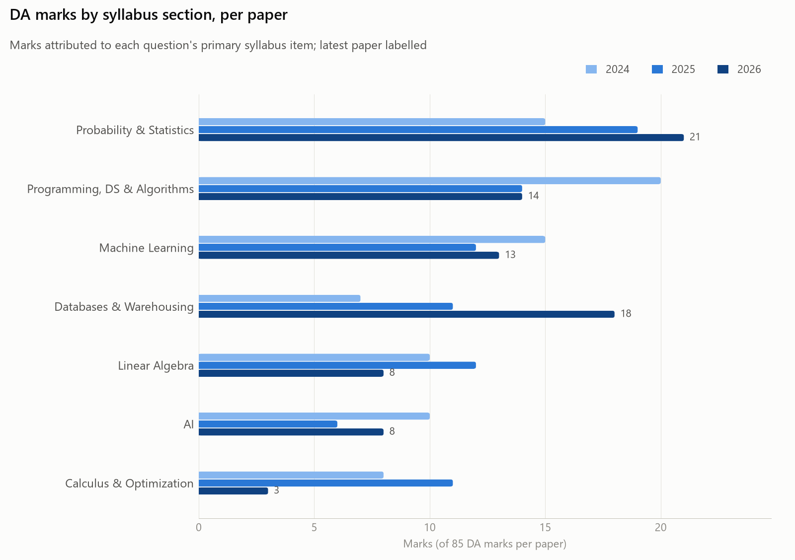
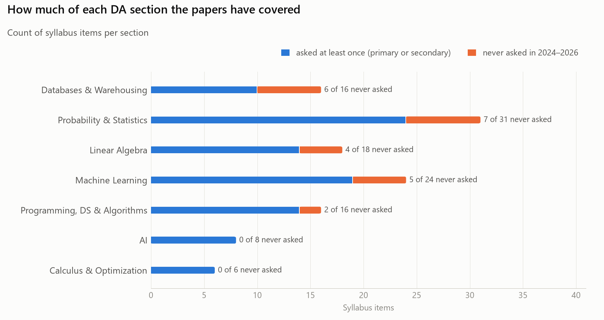
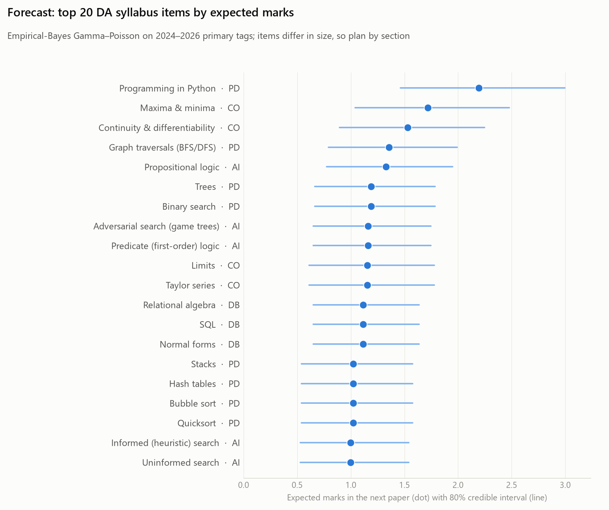

# GATE DA Atlas — analysis of the 2024–2026 papers

Generated by `python -m gate_atlas analyze` from the reference syllabus tags (Phase 2). Marks go to each
question's **primary** syllabus item unless a table says *shared* (primary weight 1, each secondary 0.5,
normalised). Every paper has 85 DA + 15 GA marks. Three papers is a small sample: read trends as history.

## Key findings

- **Three sections carry over half of the DA marks:** Probability & Statistics (18.3 marks a paper, 21.6%), Programming, DS & Algorithms (16 marks a paper, 18.8%), Machine Learning (13.3 marks a paper, 15.7%); together 56.1% of the 85 DA marks.
- **Clear moves across 2024–2026:** Probability & Statistics 15 → 19 → 21 (rising); Databases & Warehousing 7 → 11 → 18 (rising); Programming, DS & Algorithms 20 → 14 → 14 (falling). Three papers make these descriptions of the past, not forecasts.
- **Volatile sections:** Linear Algebra 10 → 12 → 8; AI 10 → 6 → 8; Calculus & Optimization 8 → 11 → 3. Their weight swings from paper to paper.
- **24 of 119 DA syllabus items were never asked** in any form, and 17 more appear only as secondary concepts. Each paper touches 60–67 DA items (50.4%–56.3% of the syllabus).
- **Asked as a primary topic in every paper:** Bayes' theorem (PS), Correlation & covariance (PS), Exponential distribution (PS), Projection matrix (LA), Eigenvalues & eigenvectors (LA), Maxima & minima (CO), Programming in Python (PD), Binary search (PD), Graph traversals (BFS/DFS) (PD), Relational algebra (DB), SQL (DB), Normal forms (DB), Linear discriminant analysis (LDA) (ML), Adversarial search (game trees) (AI), Propositional logic (AI).
- **Numerical-answer heavy:** Probability & Statistics (41.2% NAT), Calculus & Optimization (40.0% NAT). There are no options to eliminate there, so practise solving to the final number.
- **General Aptitude (15 marks):** Quantitative Aptitude 6.7 marks a paper (stable); Analytical Aptitude 4 marks a paper (rising); Verbal Aptitude 2.3 marks a paper (stable); Spatial Aptitude 2 marks a paper (mixed).
- **Item history helps only a little.** In a leave-one-paper-out backtest the Bayesian model scores Brier 0.227, against 0.234 when every item gets its section's rate and 0.265 when items are judged only by their own history. Which section an item belongs to predicts most of what comes next; plan by section and cluster first.
- **Robust to tagging choices:** replacing the reference tags with the LLM's changes any section's marks in any paper by at most 4 marks (mean 0.94).

## DA weightage by section

<picture>
  <source media="(prefers-color-scheme: dark)" srcset="analysis/charts/section_marks_dark.png">
  
</picture>

| Section | Items | 2024 | 2025 | 2026 | Mean | Share | Trend (marks/yr) | Mean, shared attribution |
|---|---|---|---|---|---|---|---|---|
| Probability and Statistics | 31 | 15 | 19 | 21 | 18.3 | 21.6% | rising (+3.0) | 18.4 |
| Programming, Data Structures and Algorithms | 16 | 20 | 14 | 14 | 16 | 18.8% | falling (-3.0) | 16.2 |
| Machine Learning | 24 | 15 | 12 | 13 | 13.3 | 15.7% | stable (-1.0) | 13.0 |
| Database Management and Warehousing | 16 | 7 | 11 | 18 | 12 | 14.1% | rising (+5.5) | 11.9 |
| Linear Algebra | 18 | 10 | 12 | 8 | 10 | 11.8% | mixed (-1.0) | 10.3 |
| AI | 8 | 10 | 6 | 8 | 8 | 9.4% | mixed (-1.0) | 7.8 |
| Calculus and Optimization | 6 | 8 | 11 | 3 | 7.3 | 8.6% | mixed (-2.5) | 7.3 |

## GA weightage by section

| Section | Items | 2024 | 2025 | 2026 | Mean | Share | Trend (marks/yr) | Mean, shared attribution |
|---|---|---|---|---|---|---|---|---|
| Quantitative Aptitude | 8 | 7 | 8 | 5 | 6.7 | 44.4% | stable (-1.0) | 6.7 |
| Analytical Aptitude | 3 | 1 | 4 | 7 | 4 | 26.7% | rising (+3.0) | 3.7 |
| Verbal Aptitude | 4 | 2 | 3 | 2 | 2.3 | 15.6% | stable (-0.0) | 2.6 |
| Spatial Aptitude | 2 | 5 | 0 | 1 | 2 | 13.3% | mixed (-2.0) | 2.1 |

## DA weightage by cluster

| Section | Cluster | Items | 2024 | 2025 | 2026 | Mean |
|---|---|---|---|---|---|---|
| DB | Relational databases | 6 | 4 | 9 | 12 | 8.3 |
| PS | Distributions | 10 | 5 | 9 | 6 | 6.7 |
| PD | Python programming | 1 | 6 | 5 | 5 | 5.3 |
| LA | Matrices | 7 | 3 | 6 | 5 | 4.7 |
| ML | Classification | 6 | 8 | 5 | 1 | 4.7 |
| CO | Calculus | 4 | 5 | 7 | 1 | 4.3 |
| PD | Searching & sorting | 7 | 5 | 2 | 6 | 4.3 |
| PS | Random variables & expectation | 6 | 4 | 4 | 4 | 4 |
| PS | Probability foundations | 8 | 3 | 3 | 5 | 3.7 |
| PD | Data structures | 5 | 6 | 3 | 1 | 3.3 |
| AI | Search | 3 | 4 | 4 | 2 | 3.3 |
| AI | Logic | 2 | 3 | 1 | 6 | 3.3 |
| CO | Optimization | 2 | 3 | 4 | 2 | 3 |
| PD | Graphs | 3 | 3 | 4 | 2 | 3 |
| PS | Descriptive statistics | 2 | 3 | 1 | 4 | 2.7 |
| ML | Neural networks | 2 | 2 | 3 | 2 | 2.3 |
| LA | Linear systems | 4 | 2 | 4 | 0 | 2 |
| LA | Eigenvalues & decompositions | 3 | 3 | 1 | 2 | 2 |
| ML | Clustering | 7 | 3 | 1 | 2 | 2 |
| DB | Storage & indexing | 2 | 2 | 0 | 3 | 1.7 |
| DB | Data warehousing | 3 | 0 | 2 | 3 | 1.7 |
| ML | Regression | 3 | 0 | 1 | 4 | 1.7 |
| PS | Statistical inference | 5 | 0 | 2 | 2 | 1.3 |
| LA | Vector spaces | 4 | 2 | 1 | 1 | 1.3 |
| ML | Supervised learning setup | 1 | 2 | 0 | 2 | 1.3 |
| AI | Reasoning under uncertainty | 3 | 3 | 1 | 0 | 1.3 |
| ML | Dimensionality reduction | 2 | 0 | 2 | 1 | 1 |
| DB | Data preprocessing | 5 | 1 | 0 | 0 | 0.3 |
| ML | Model evaluation & selection | 3 | 0 | 0 | 1 | 0.3 |

## Topics never asked

<picture>
  <source media="(prefers-color-scheme: dark)" srcset="analysis/charts/coverage_dark.png">
  
</picture>

| Section | Never-asked items (chance of appearing in the next paper) |
|---|---|
| DA: Database Management and Warehousing | File organization (29.2%), Data (attribute) types (29.2%), Discretization (29.2%), Sampling (29.2%), Compression (29.2%), Measures: categorization & computation (29.2%) |
| DA: Linear Algebra | Matrices (general) (24.1%), Partitioned matrices & properties (24.1%), Projections (24.1%), LU decomposition (24.1%) |
| DA: Machine Learning | Multiple linear regression (24.4%), k-fold cross-validation (24.4%), Clustering algorithms (general) (24.4%), Top-down (divisive) clustering (24.4%), Dimensionality reduction (general) (24.4%) |
| DA: Probability and Statistics | Probability axioms (24.6%), Discrete uniform distribution (24.6%), Continuous random variables & PDFs (24.6%), Confidence intervals (24.6%), z-test (24.6%), t-test (24.6%), Chi-squared test (24.6%) |
| DA: Programming, Data Structures and Algorithms | Linear search (34.4%), Merge sort (34.4%) |
| GA: Quantitative Aptitude | Ratios (43.0%) |
| GA: Verbal Aptitude | Narrative sequencing (31.2%) |

## Question types by section

| Section | MCQ | MSQ | NAT | NAT share |
|---|---|---|---|---|
| Probability & Statistics | 16 | 4 | 14 | 41.2% |
| Programming, DS & Algorithms | 15 | 9 | 7 | 22.6% |
| Machine Learning | 13 | 6 | 7 | 26.9% |
| Databases & Warehousing | 10 | 6 | 7 | 30.4% |
| Linear Algebra | 8 | 8 | 3 | 15.8% |
| AI | 10 | 5 | 2 | 11.8% |
| Calculus & Optimization | 3 | 6 | 6 | 40.0% |

## Forecast for the next paper

<picture>
  <source media="(prefers-color-scheme: dark)" srcset="analysis/charts/forecast_dark.png">
  
</picture>

| Item | Section | Asked 2024–26 (primary) | Expected marks next paper | P(asked) | 80% interval, questions |
|---|---|---|---|---|---|
| Programming in Python | PD | 9 | 2.19 | 74.0% | 0.94–1.94 |
| Maxima & minima | CO | 5 | 1.72 | 66.8% | 0.71–1.69 |
| Continuity & differentiability | CO | 4 | 1.53 | 62.5% | 0.61–1.53 |
| Graph traversals (BFS/DFS) | PD | 4 | 1.36 | 56.5% | 0.51–1.29 |
| Propositional logic | AI | 4 | 1.33 | 58.9% | 0.55–1.38 |
| Trees | PD | 3 | 1.19 | 51.8% | 0.43–1.15 |
| Binary search | PD | 3 | 1.19 | 51.8% | 0.43–1.15 |
| Adversarial search (game trees) | AI | 3 | 1.16 | 54.1% | 0.46–1.24 |
| Predicate (first-order) logic | AI | 3 | 1.16 | 54.1% | 0.46–1.24 |
| Limits | CO | 2 | 1.15 | 52.2% | 0.42–1.21 |
| Taylor series | CO | 2 | 1.15 | 52.2% | 0.42–1.21 |
| Relational algebra | DB | 4 | 1.11 | 49.5% | 0.42–1.05 |
| SQL | DB | 4 | 1.11 | 49.5% | 0.42–1.05 |
| Normal forms | DB | 4 | 1.11 | 49.5% | 0.42–1.05 |
| Stacks | PD | 2 | 1.02 | 46.6% | 0.35–1.02 |
| Hash tables | PD | 2 | 1.02 | 46.6% | 0.35–1.02 |
| Bubble sort | PD | 2 | 1.02 | 46.6% | 0.35–1.02 |
| Quicksort | PD | 2 | 1.02 | 46.6% | 0.35–1.02 |
| Informed (heuristic) search | AI | 2 | 1.00 | 48.8% | 0.37–1.09 |
| Uninformed search | AI | 2 | 1.00 | 48.8% | 0.37–1.09 |
| Conditional independence (Bayesian networks) | AI | 2 | 1.00 | 48.8% | 0.37–1.09 |
| Indexing (incl. B/B+ trees) | DB | 3 | 0.98 | 45.0% | 0.35–0.94 |
| Functions of a single variable | CO | 1 | 0.96 | 46.1% | 0.32–1.05 |
| Single-variable optimization | CO | 1 | 0.96 | 46.1% | 0.32–1.05 |
| Exponential distribution | PS | 4 | 0.93 | 42.7% | 0.34–0.85 |

Model: per-item yearly question counts are Poisson with a Gamma prior centred on the item's section rate; the
shared Gamma shape is fitted by maximum marginal likelihood (DA shape = 4.0977; GA's fit runs to the
upper bound, i.e. GA items within a section are indistinguishable and get their section rate). Expected marks
use the section's average marks per question. Items differ in size ("Programming in Python" vs "z-test"), so
compare items within a section and plan time by section and cluster.

| Backtest (leave one paper out) | Brier ↓ | Log loss ↓ | Count RMSE ↓ |
|---|---|---|---|
| DA — pooled | 0.2338 | 0.6607 | 0.6536 |
| DA — empirical | 0.2647 | 2.6827 | 0.6736 |
| DA — bayes | 0.2271 | 0.6462 | 0.6374 |
| GA — pooled | 0.2570 | 0.7106 | 0.7804 |
| GA — empirical | 0.4118 | 4.1730 | 0.9393 |
| GA — bayes | 0.2570 | 0.7108 | 0.7805 |

## Concepts that travel together

Cross-section pairs tagged on the same question (primary or secondary). Study them together.

| Concept | Often needed with | Questions |
|---|---|---|
| Analogy (GA.AA.02) | Vocabulary: words, idioms & phrases (GA.VA.02) | 3 |
| Uninformed search (DA.AI.02) | Graph traversals (BFS/DFS) (DA.PD.15) | 1 |
| Approximate inference: sampling (DA.AI.08) | Naive Bayes classifier (DA.ML.07) | 1 |
| Approximate inference: sampling (DA.AI.08) | Linear discriminant analysis (LDA) (DA.ML.08) | 1 |
| Approximate inference: sampling (DA.AI.08) | k-means / k-medoids (DA.ML.17) | 1 |
| Limits (DA.CO.02) | Poisson distribution (DA.PS.20) | 1 |
| Limits (DA.CO.02) | Central limit theorem (DA.PS.27) | 1 |
| Continuity & differentiability (DA.CO.03) | Feed-forward neural networks (DA.ML.15) | 1 |
| Data normalization (scaling) (DA.DB.10) | Mean, median, mode & standard deviation (DA.PS.10) | 1 |
| Eigenvalues & eigenvectors (DA.LA.12) | Linear discriminant analysis (LDA) (DA.ML.08) | 1 |
| Eigenvalues & eigenvectors (DA.LA.12) | Principal component analysis (PCA) (DA.ML.24) | 1 |
| Naive Bayes classifier (DA.ML.07) | Bayes' theorem (DA.PS.08) | 1 |
